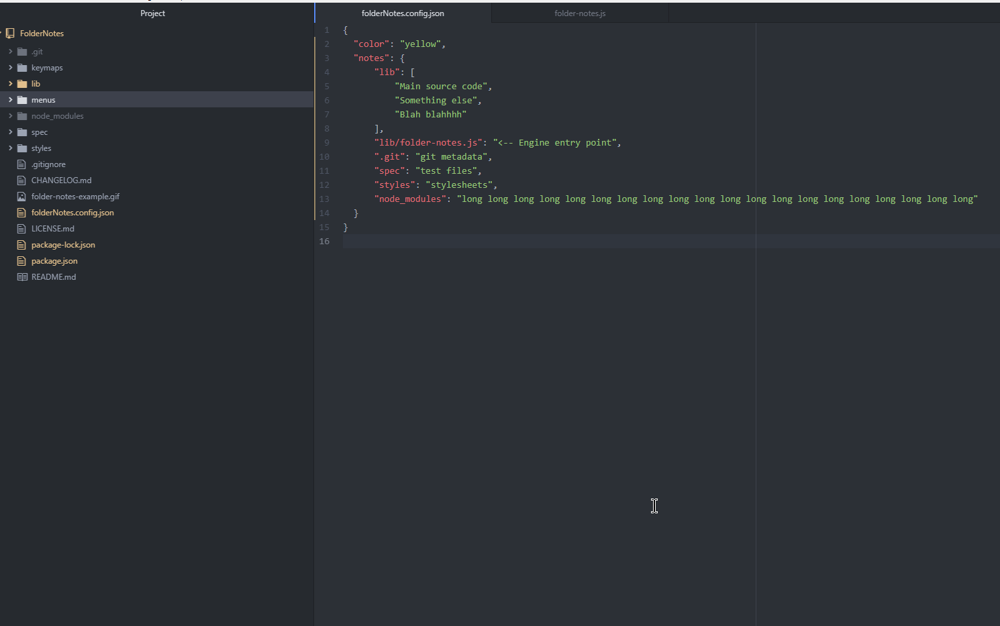

# folder-notes package

Lets you put notes on the file tree


## Instructions:
1. After installation, create a file named "folderNotes.config.json" in your folder path.
2. Add a json object to this file containing relative paths and the notes you desire. Example"
```
{
  "notes": {
    "lib": "COMPILED SOURCE DONT TOUCH",
    "app": "should be named src",
    "client": "stuff"
  }
}
```
3. Reload your atom window (Ctrl+Shift+F5) 
4. Toggle FolderNotes on or off through the packages->folder-notes menu option or through the right-click menu
5. Enjoy!


Additional config options:

| Option        | description           | default  |
| ------------- |:-------------:| -----:|
| color      | the color of the notes | yellow |
